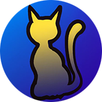

<div align="center">


<br><br>

<h1><strong>CryptoCats - Create, Breed and Sell some funny lookin' cats!</strong></h1>

[](https://github.com/Pedrojok01/CryptoCats/stargazers)
[](https://github.com/Pedrojok01/CryptoCats/issues)
[](https://github.com/Pedrojok01/CryptoCats/blob/main/License)
[](https://codecov.io/gh/Pedrojok01/CryptoCats)
[](https://www.linkedin.com/in/pierre-e/)
[](https://app.netlify.com/sites/crypto-cats/deploys)

<br></br>


</div>
<br></br>

<!-- TABLE OF CONTENTS -->

  <summary>Table of Contents</summary>
  <ol>
    <li>
      <a href="#Description">Description</a>    
    </li>
    <li>
      <a href="#Features">Features</a>
    </li>
    <li><a href="#built-with">Built With</a></li>
    <li><a href="#getting-started">Getting Started</a>
    <ul>
        <li><a href="#prerequisites">Prerequisites</a></li>
        <li><a href="#installation">Installation</a></li>
        <li><a href="#contracts-deployment">Contracts deployment</a></li>
        <li><a href="#config">Config</a></li>
      </ul>
    </li>
    <li><a href="#use">Use</a></li>
  </ol>

<br></br>

## UPDATES:

#### Mars 2024

- Migrate to Sepolia testnet after Goerli deprecation (Dencun fork);

#### Oct 2023

- Added support for WalletConnect v2;
- Removed ethers.js in favor of Viem to follow Wagmi's updates;
- Refactored many components with new customs hooks;
- Moved the frontend app into its own folder for better readability and easier deployment;
- Removed all dependencies related to hardhat/contracts development and moved them to the hardhat folder;
- Upgrade all dependencies to the latest versions;
- Add favicons;

#### Dec 2022

CryptoCats Revisited. No more vanilla JS (which, despite being a huge mess, was quite an achievement in itself nonetheless), but a fast & modern app built with Hardhat (smart contracts) / Next.js (front-end) / ChakhraUI (components) / Wagmi (Web3) instead.

## Description

Decentralized application (Dapp) deployed on Sepolia, but compatible with all EVM networks. Initially built as a part of the programming course: Ethereum Dapp Programming on [academy.moralis.io](https://academy.moralis.io/courses/ethereum-dapp-programming).

Try it yourself: [crypto-cats.netlify.app/](https://crypto-cats.netlify.app/)

## Features

- [x] Factory - Design and Create your own Cat for FREE in the Cat Factory! When you're done, just click on the `Create` button to mint your cat! (Limited to 100 Cats)
- [x] MyCats/Show - Display all the cats present in your collection;
- [x] MyCats/Breed - Select two parents, breed a seebling out, and find out which characteristics you inherited from each!
- [x] MyCats/Sell - Create a sell offer to list your cat on the marketplace!
- [x] Marketplace - Buy some cats on the marketplace or simply remove your offers.

## Built With

- [![solidity]][solidity-url]
- [![hardhat]][hardhat-url]
- [![viem]][viem-url]
- [![nextjs]][nextjs-url]
- [![typescript]][typescript-url]
- [![chakraUI]][chakraui-url]
- [![prettier]][prettier-url]
- [![ESLint]][eslint-url]

## Getting Started

### Prerequisites:

- `Node.JS` version ^18 installed;
- `npm` | `yarn` packages manager installed;
- [hardhat](https://hardhat.org/hardhat-runner/docs/getting-started#overview) installed via `yarn add --dev hardhat` (developed on v2.18.0).
- [MetaMask](https://metamask.io/), [Coinbase Wallet](https://www.coinbase.com/wallet) or any web3 wallet compatible with [WalletConnect](https://walletconnect.com/) installed.

### Installation:

Clone the repo with the following command:

```sh
git clone https://github.com/Pedrojok01/CryptoCats
```

### Contracts deployment

- Make sure you're on the root directory, then type the following command:

```bash
cd hardhat
```

- Once you are in the `hardhat` repo, install all dependencies with:

```bash
yarn install
```

#### To deploy your own smart contracts:

- Remove `.example` from the `.env.example` file and edit the file with your API KEYs for the networks you wish to use and your PRIVATE KEY (<b>Do not paste your private key anywhere else!</b>);
- Edit the `hardhat.config.ts` if needed, and the `"deploy"` script in the `package.json` file with the network needed;
- To deploy your smart contracts simply run the command below, and wait for the contract addresses and ABI to appear in your console:

  ```sh
  yarn deploy
  ```

- Replace the contract addresses (both `CAT_CONTRACT` & `MARKETPLACE_CONTRACT_ADD`) and the corresponding chains infos in the `src/data/constant.ts` file;
- And don't forget to have some funds ready if you want to buy some CryptoCats on the marketplace! [Faucet for the Sepolia network](https://sepolia-faucet.pk910.de/);

#### On each deploy, make sure to:

- Change the `CAT_CONTRACT_ADD` and the `MARKETPLACE_CONTRACT_ADD` in `src/data/constant.ts` to your deployed contracts address;
- Edit the ABI files in `src/data/abis/` if you made any changes to the smart contracts;
- Enable/disable/update the suitable networks in `hardhat.config.ts`, `package.json` & `src/data/constant.ts`;

### Front-end deployment

#### Setup:

- Go back to the root directory with the following command:

```bash
cd ..
```

- Then move to the frontend folder by running:

```bash
cd nextjs_frontend
```

- Once you are in the `nextjs_frontend` repo, install all dependencies with:

```bash
yarn install
```

#### To deploy your frontend locally:

Remove `.example` from the `.env.example` file and edit the file with your own API KEYs;

You are now set to start your local server. Make sure you're still in the in the `nextjs_frontend` directory and type:

```sh
yarn dev
```

#### To deploy your front-end on Netlify:

- Upload your project to GitHub or GitLab;
- Make sure you have a [Netlify](https://www.netlify.com/) account;
- Create a new site from the Netlify dashboard;
- Link your GitHub/GitLab account to Netlify;
- Select the repo you want to deploy;
- Add the .env variables to the Netlify dashboard;
- Deploy your site!

<br></br>

<div align="center">
<h2>Enjoy!!!</h2>

### ⭐️ ... and don't forget to leave a star if you like it! ⭐️

</div>

<p align="right">(<a href="#top">back to top</a>)</p>

<!-- MARKDOWN LINKS & IMAGES -->

[solidity]: https://img.shields.io/badge/Solidity_v8.0.19-35495E?style=for-the-badge&logo=solidity&logoColor=4FC08D
[solidity-url]: https://soliditylang.org/
[typescript]: https://img.shields.io/badge/Typescript_v5.2.2-375BD2?style=for-the-badge&logo=typescript&logoColor=#3178C6
[typescript-url]: https://www.typescriptlang.org/
[chakraui]: https://img.shields.io/badge/chakra_UI-green?style=for-the-badge&logo=chakraUI&logoColor=#319795
[chakraui-url]: https://chakra-ui.com/
[nextjs]: https://img.shields.io/badge/Next_JS-3173b4?style=for-the-badge&logo=next.js&logoColor=#000000
[nextjs-url]: https://nextjs.org/
[prettier]: https://img.shields.io/badge/Prettier-360D3A?style=for-the-badge&logo=Prettier&logoColor=61DAFB
[prettier-url]: https://prettier.io/
[eslint]: https://img.shields.io/badge/ESLint-4B32C3?style=for-the-badge&logo=ESLint&logoColor=61DAFB
[eslint-url]: https://eslint.org/
[hardhat]: https://img.shields.io/badge/Hardhat-FF0000?style=for-the-badge&logo=data:image/png;base64,iVBORw0KGgoAAAANSUhEUgAAADoAAAA1CAYAAAAQ7fj9AAAAAXNSR0IArs4c6QAAAARnQU1BAACxjwv8YQUAAAAJcEhZcwAADsMAAA7DAcdvqGQAAAWUSURBVGhD7ZlrTFtlGIBPWwpt7VoRERghRCM44x+zwRKNmUbUwebmLZvXKWjihSnxD7DE/VgCS3Qui9nUqD82My8bsokzjggbl82BBgcMGDCGQwKMoQiFcR8br9/7wam9vOfSnm5xXX88Sdtze5++3/d+7zlHiF2cCDcCIdFgIyQabIREA8VTT8bA5k23wIdbb+bUlJs44vec7ChIS4sjjw0kV0UUA0cZGBV8ovSgBZKXJJDn1MpVEa094rukyBe7bOQ5tRJQ0RUPLobqUhOM9OpJCTXgsTicA53ZgIjiUG2vM8KVYQHmRmgBX0FhnMOBEtYkGhefCGUlZrj8j8C5MkQHrYWe1jB4mhU06vq+4LfoKxuiYbxXB7N/CU7mWEapYAPB/i+tmrLrl+i7G6Ng5oIAl1yYHaAD9KT9pJn8XQ0tv4X7Leuz6J5PF8HMecGLy4N0cJ5kvhQDX+9OJrepAWVTl8eTscnhk2jOW1Ew3SuQzDnowFwp3muA1JQ4WP9cOgx0XtvMqhZdnRELkz0CTBFM99EBuTLBhvcdt5u56Oo1a6BgSwq5n1pOnQgn45RClWh8QiI4OnUw2S2Q4BylgnFlc64RLBaLUxRp/jWK3FcVbBmrZd0XFS+FKtHyA2aY+JNlRQJcWshgFuhq0oHNZvYSzXo1jdxfLXjd11+7lYzZE0XRR1gzMHGOCcmg1CSsWhnBJT1FES2FCUWHuvRk3J4oirbVGGH8D0GSSZZRKgiRH741OCUpUSxMY/1G8lglsEHBabNzm3J/LCuamhoPY50CjJ2VZopVXCoIZPpvAZLuNMmKIju23UserwS2nLi0DXYqZ1VW9NBXFrjYIcgy008HgVQf1oPdPj83RZYToplZaX5nVaz8z6+/jXQQkRUdbtPBaLsgyyzLGhWASHeLDjIeo+foumfTNc1RBNdwrPwNVfLLjaTo46tiYaSN3UUoINfIX2BDu6Nexz+XfGPgw1gUzc+739k0aFlmcOpMdAngOKsjPUQkRffssoLjNDuBAkoV9503jPAeW0OxYUA+KIiE2opYvg1FN+Xdp0kUm5VxVvmRZSnSraGk6OljYaSYG630xV2ZYnc1dy8x8Wwe2mdw/o5DFjP7+cf3uO3vK1gjeMFk7NhqJ10QSdH+ej04WpiMDDhHqYt70viLDqzW+aL0wjozbxRQ8u2NK/wuQiLTrOqKhbGqRLpTkhQdZN3McLMgC85R6uIU2wvDuOhdyRZnMTrXZCP39QUcuhfPzOOXKGZsuEmeERVDVwTn8qMPRzhFtVZbEay6o+wPR5qrjKQLIilKiXniS0YRrMIpS2/iFZfa7g+4vI2weoGcb5BuHCRFh06xPlIBLEjUxeX4sciq6V7UE+yMHGwaIX2srlAuiLRoI5NBmBAOC2zesQPBE+PzIWyoA/XETws4dMUR1nfSR9HMDdH8BLzr+R/IqOHSABu6LQbJ1xteoviYgjrR9QT1tN9LlDoQnwc1HguH5uNGqDhggqrvTdBRp23984fG6nA4Wmzi4GepGPCViKcXKdrxuxFO/BQBx0si4Ey1watRwImP62jldxGaXj+oBYXqDxv/qxse4LbKoggoKzJDX6tBnWh5kYmvj24slG/e9nkIt1cYeLapAANB5UETKSfHJ+8vcnNCvESTkxMgOysKjuwzORdifqfiIu0mvJDdhlIjVLGgcEjhv0oFrQbMHh+i7A9vO2ogRSi6a/Swe7sVXnwm2s1HxEvUkycyYiA/JxJ2Ftq4fE+d3lt4QZaXeVxjiUACSUtZGPy81wQFuXZ48+UoeOgB5RfJiqJSLFsaD2vTYziF+XYozLNDAaP4MwsPQgoxSDk+2mLjEkhudiSsXcmuw0hKusbvXq5HQqLBRkg02AiJBhsh0WAjJBps3CCiifAv+kBDzN+k+08AAAAASUVORK5CYII=
[hardhat-url]: https://hardhat.org/
[viem]: https://img.shields.io/badge/Viem-ffc517?style=for-the-badge&logo=data:image/jpeg;base64,/9j/4AAQSkZJRgABAQEASABIAAD/2wBDAAEBAQEBAQEBAQEBAQEBAQEBAQEBAQEBAQEBAQEBAQEBAQEBAQEBAQEBAQEBAQEBAQEBAQEBAQEBAQEBAQEBAQH/2wBDAQEBAQEBAQEBAQEBAQEBAQEBAQEBAQEBAQEBAQEBAQEBAQEBAQEBAQEBAQEBAQEBAQEBAQEBAQEBAQEBAQEBAQH/wAARCAAeAB4DASIAAhEBAxEB/8QAHwAAAQUBAQEBAQEAAAAAAAAAAAECAwQFBgcICQoL/8QAtRAAAgEDAwIEAwUFBAQAAAF9AQIDAAQRBRIhMUEGE1FhByJxFDKBkaEII0KxwRVS0fAkM2JyggkKFhcYGRolJicoKSo0NTY3ODk6Q0RFRkdISUpTVFVWV1hZWmNkZWZnaGlqc3R1dnd4eXqDhIWGh4iJipKTlJWWl5iZmqKjpKWmp6ipqrKztLW2t7i5usLDxMXGx8jJytLT1NXW19jZ2uHi4+Tl5ufo6erx8vP09fb3+Pn6/8QAHwEAAwEBAQEBAQEBAQAAAAAAAAECAwQFBgcICQoL/8QAtREAAgECBAQDBAcFBAQAAQJ3AAECAxEEBSExBhJBUQdhcRMiMoEIFEKRobHBCSMzUvAVYnLRChYkNOEl8RcYGRomJygpKjU2Nzg5OkNERUZHSElKU1RVVldYWVpjZGVmZ2hpanN0dXZ3eHl6goOEhYaHiImKkpOUlZaXmJmaoqOkpaanqKmqsrO0tba3uLm6wsPExcbHyMnK0tPU1dbX2Nna4uPk5ebn6Onq8vP09fb3+Pn6/9oADAMBAAIRAxEAPwD+M39iD9iH4gft8fFuz+Bvwm+JvwI8D/FDXbvTNN8D+GfjZ8Q5vh3L8R9a1RdRaLQPA14dA1iw1bXol07B0i5ubC9vZr7TrTSItSvLr7On2t+33/wQn/a9/wCCZ/w/0Xx/+1p8Rv2XfBY8Xx+ID8PfBmlfFzVde8e/Em48KPoC+JbPwV4ft/BESajPoUfijQp9Tlvb7TbG0j1K0WW8E1zbxS/kJ4H8a+Kvht418IfEXwLrd94Z8beAfFGgeNPB3iPTJPJ1Lw/4p8Laraa54f1vT5SGEV7pWrWNpfWshVgk8EbEEDFf6VX/AAVe8P8Ahf8A4Lwf8G73w6/bq+FujWVz8bPgb4ST9ottB0dDPe6D4j+H9ld+EP2tfhXCC0+oJplpY6Z4k8WaHavANQ8S/wDCC+ArqGJINWhdgD+FX9ir/gmB8WP28fDXjjXvg58df2T/AA5qXwx8B+M/it8R/Bnxc+MV38OvFvgf4V+AbqwtfFPxJ8Qwaj4QudDt/BulHU9PuLzV4NduRZWt5BPqEVmr18F/EbwbD8PvG3iLwZb+MvBXxCh8P3wsk8Z/DnVL/W/BOv8A+jwzteeHdV1PSdDvr6xVpjbmefSrMtcQTCNHiCSyfqP4Dvj+yH/wSb+JfjyNzp3xm/4KgfEOT4E+CplJh1TSP2M/2a/EGi+L/jdrlncwYnt9N+Mn7QLfDv4cFJnWHVtO+Dfj/TgrwpdpJ+QdABX9wH/Bmv8At+2PhX4t/Gz/AIJo/FLUbW78D/tA6Vq/xd+C+k62YrjS3+Jfhfw+lh8VPBcVjc+ZDdf8LA+F+nW3iKW1ljFmsPwu1KNle41krL/D/XX+AvH/AI2+Fvi/QviB8OPFWveCPG/hi7a/8PeKvDOpXWj67o148E1rJcafqNnJFcW0ktrcXFtL5bgS2880EgaKR1YA/QX/AIK2/HP4U/F79sjxh4J/ZvtI9J/ZM/Zb0q0/ZZ/ZY0W2vpNSsk+E3wp1TWYrvxbBqEjF9Sl+K3xH1fx78W7rU5UiubyXxz/pMavEFX8y6KKAP//Z
[viem-url]: https://viem.sh/
