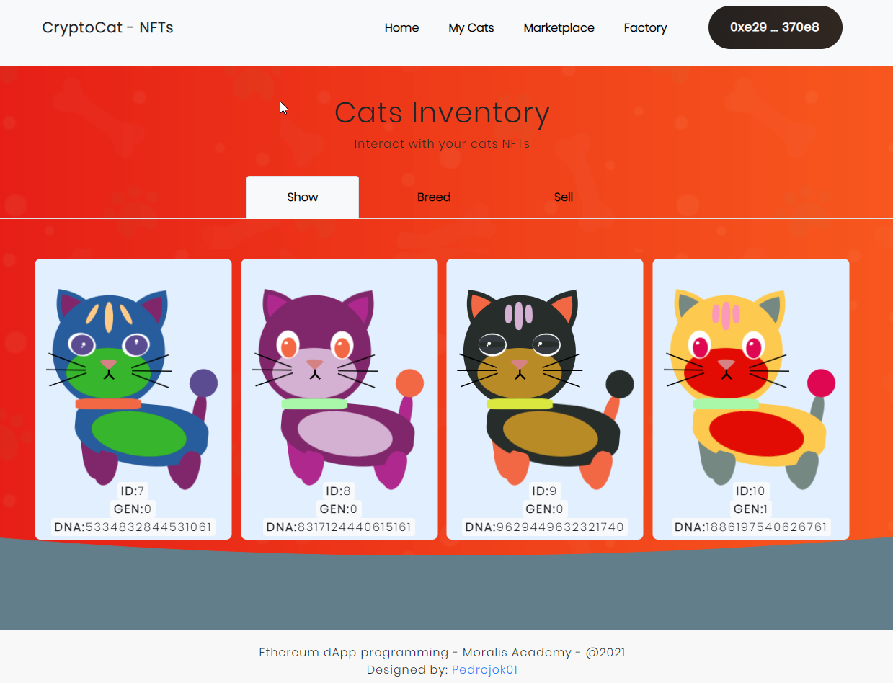

# CryptoCats dApp - Create, Breed and Sale some funny lookin' cats!

Dapp built on the Ethereum Network as a part of the programming course: Ethereum Dapp Programming on [academy.moralis.io](https://academy.moralis.io/courses/ethereum-dapp-programming).

Try it yourself: [crypto-cats.netlify.app/](https://crypto-cats.netlify.app/)

Decentralized application for the Ethereum Network built with:

- Solidity ^0.8.6
- Truffle
- Ganache
- Infura
- Web3.js and OpenZeppelin libraries

## Installation

Make sure you have the following ready:

- `Node.JS` installed
- `npm` installed
- [Truffle](https://www.trufflesuite.com/docs) installed globally via `npm install -g truffle` (developed on v5.3.2).
- A local blockchain via [Ganache](https://www.trufflesuite.com/docs/ganache/overview), or [Ganache-cli](https://github.com/trufflesuite/ganache-cli), or a registered account on [Infura.io](https://infura.io/) to deploy on an Ethereum network.
- [MetaMask](https://metamask.io/) installed in your browser
- Cloned the repo via `git clone`

## Contracts deployment

In order to install the required libraries, go to the `CryptoCats` repo in your terminal and type:
`cd blockchain`
`npm install`

To deploy your own smart-contracts:

- Run `truffle migrate --network <<network name here>>` to deploy to the network of your choice. i.e.: for Kovan, type `truffle migrate --network kovan`;
- Replace the contract addresses (both `CatContract` & `CatMarketplace`) at the top of the file `client/index.js`;
- Make sure to have some fund ready if you want to buy some CryptoCats on the marketplace: [Faucet for the Kovan network](https://kovan.chain.link/);

## Config

On each deploy, make sure to:

- Change the `CAT_CONTRACT_ADD` and the `MARKETPLACE_CONTRACT_ADD` in `/client/index.js` to your deployed contracts address;
- Edit the abi file in `/client/assets/js/utils/abi.js` in you make any changes to the smart-contracts;
- Enable/disable, and update the suitable networks in `truffle-config.js`;
- Get your mnemonic seed phrase add it to `blockchain/.secret`;

## Use

You are now set to start your local server. Make sure you're in `CryptoCats/client` and launch the local server using the following command: `python3 -m http.server 8000`. You can then access the app in your browser at: [http://localhost:8000/](http://localhost:8000/).
